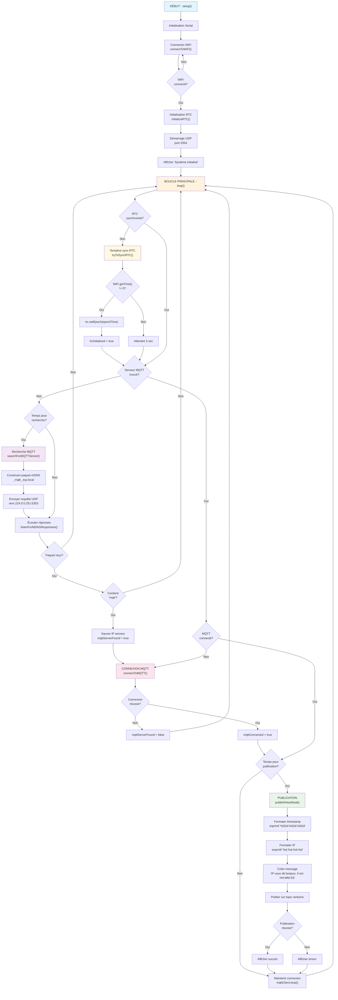

# Arduino MKR 1010 - mDNS MQTT Client

Un client Arduino qui découvre automatiquement les serveurs MQTT sur le
réseau local via mDNS et publie des messages de heartbeat toutes les minutes.

## 📋 Table des matières

- [Fonctionnalités](#-fonctionnalités)
- [Matériel requis](#-matériel-requis)
- [Librairies nécessaires](#-librairies-nécessaires)
- [Configuration](#️-configuration)
- [Installation](#-installation)
- [Fonctionnement](#-fonctionnement)
- [Organigramme](#-organigramme)
- [Messages série](#-messages-série)
- [Format des messages MQTT](#-format-des-messages-mqtt)
- [Dépannage](#️-dépannage)
- [Licence](#-licence)

## ✨ Fonctionnalités

- **Découverte automatique** des serveurs MQTT via mDNS (`_mqtt._tcp.local`)
- **Synchronisation RTC** avec serveurs de temps via WiFi.getTime()
- **Publication périodique** de messages heartbeat (toutes les minutes)
- **Gestion d'erreurs robuste** avec récupération automatique
- **Code optimisé** utilisant `snprintf` pour le formatage
- **Fonctionnement non-bloquant** avec gestion d'états

## 🔧 Matériel requis

- Arduino MKR WiFi 1010
- Connexion WiFi 2.4GHz
- Serveur MQTT sur le réseau local
  (ex: Mosquitto, Home Assistant, etc.)

## 📚 Librairies nécessaires

Les librairies suivantes doivent être installées via
 le gestionnaire de librairies Arduino :

- `WiFiNINA` (incluse avec MKR 1010)
- `RTCZero` (incluse avec MKR 1010)
- `PubSubClient` par Nick O'Leary

## ⚙️ Configuration

### 1. Fichier arduino_secrets.h

Créez un fichier `arduino_secrets.h` dans le même dossier que le sketch :

```cpp
#define SECRET_SSID "VotreNomWiFi"
#define SECRET_PASS "VotreMotDePasseWiFi"
```

### 2. Configuration réseau

Le code utilise les paramètres par défaut suivants :

- **Port MQTT** : 1883 (standard)
- **Topic de publication** : `/arduino`
- **Port UDP local** : 5354
- **Adresse multicast mDNS** : 224.0.0.251:5353

## 🚀 Installation

1. **Clonez** le repository

   ```bash
   git clone https://github.com/[username]/Arduino-mDNS-UDP.git
   cd Arduino-mDNS-UDP
   ```

2. **Créez** le fichier de configuration

   ```bash
   cp arduino_secrets.h.example arduino_secrets.h
   ```

3. **Éditez** `arduino_secrets.h` avec vos paramètres WiFi

   ```cpp
   #define SECRET_SSID "VotreNomWiFi"
   #define SECRET_PASS "VotreMotDePasseWiFi"
   
   // Optionnel: personnaliser le topic MQTT
   // #define MQTT_TOPIC "/mon-arduino"
   ```

4. **Ouvrez** `Arduino-mDNS-UDP.ino` dans l'IDE Arduino

5. **Installez** les librairies nécessaires via le gestionnaire de librairies

6. **Sélectionnez** la carte "Arduino MKR WiFi 1010"

7. **Téléversez** le code

## 🔄 Fonctionnement

### Phase 1 : Initialisation

1. **Connexion WiFi** - Établissement de la connexion réseau
2. **Initialisation RTC** - Démarrage du module d'horloge temps réel
3. **Synchronisation RTC** - Récupération de l'heure via WiFi.getTime()
4. **Démarrage UDP** - Initialisation du client mDNS

### Phase 2 : Découverte MQTT

1. **Requête mDNS** - Envoi de `_mqtt._tcp.local` toutes les 30 secondes
2. **Écoute des réponses** - Analyse des paquets UDP entrants
3. **Détection MQTT** - Identification des serveurs MQTT disponibles
4. **Sauvegarde IP** - Mémorisation de l'adresse du serveur trouvé

### Phase 3 : Publication MQTT

1. **Connexion MQTT** - Établissement de la connexion au serveur
2. **Publication périodique** - Envoi de messages toutes les minutes
3. **Maintenance** - Surveillance de la connexion MQTT

## 📊 Organigramme



## 📟 Messages série

### Démarrage typique

```text
Démarrage du client mDNS/MQTT
Connexion au réseau WiFi: MonWiFi
....
WiFi connecté!
Adresse IP: 192.168.1.100

Initialisation du module RTC...
RTC démarré, synchronisation en cours...

Système initialisé
Recherche d'un serveur MQTT...

Tentative de synchronisation RTC avec WiFi.getTime()...
RTC synchronisé avec WiFi.getTime()!
Heure actuelle: 23/06/2025 14:35:22

--- Recherche serveur MQTT ---
Requête mDNS envoyée

*** SERVEUR MQTT TROUVÉ! ***
IP du serveur: 192.168.1.50
Arrêt de la recherche mDNS
Connexion au serveur MQTT...

Connexion MQTT à 192.168.1.50:1883
Connexion MQTT réussie!
Publication de messages toutes les minutes...
```

### Publication de messages

```text
--- Publication MQTT ---
Sujet: /arduino
Message: 192.168.1.100 vous dit bonjour. Il est 14:35:22
Message publié avec succès!
```

## 📨 Format des messages MQTT

### Topic

```text
/arduino
```

### Payload

```text
<IP_Arduino> vous dit bonjour. Il est <HH:MM:SS>
```

### Exemple

```text
192.168.1.100 vous dit bonjour. Il est 14:35:22
```

## 🛠️ Dépannage

### Problèmes courants

#### WiFi ne se connecte pas

- Vérifiez les identifiants dans `arduino_secrets.h`
- Assurez-vous que le réseau est en 2.4GHz
- Vérifiez la portée du signal WiFi

#### Serveur MQTT non trouvé

- Vérifiez que le serveur MQTT est démarré
- Testez la connectivité réseau avec `ping`
- Vérifiez que le serveur annonce le service mDNS

#### RTC non synchronisé

- Vérifiez la connexion Internet
- Le système continue de fonctionner avec `--:--:--`
- La synchronisation sera retentée automatiquement

#### Messages MQTT non reçus

- Vérifiez la connexion au broker MQTT
- Testez avec un client MQTT (ex: MQTT Explorer)
- Vérifiez les logs du serveur MQTT

### Messages de debug

Le code affiche des messages détaillés pour faciliter le debug :

- État des connexions WiFi et MQTT
- Tentatives de synchronisation RTC
- Détection des serveurs MQTT
- Succès/échecs des publications

## 🔧 Personnalisation

### Types de services supportés

Dans `config.h`, vous pouvez rechercher différents types de services :

```cpp
// Service MQTT standard
#define MDNS_SERVICE_TYPE "mqtt"

// Service MQTT sécurisé (SSL/TLS)
#define MDNS_SERVICE_TYPE "mqtts"

// Broker Mosquitto spécifique
#define MDNS_SERVICE_TYPE "mosquitto"
```

### Modifier l'intervalle de publication

```cpp
const unsigned long PUBLISH_INTERVAL = 30000; // 30 secondes
```

### Changer le topic MQTT

**Option 1** : Dans `config.h`

```cpp
#define MQTT_TOPIC "/mon-arduino"
```

**Option 2** : Directement dans le code

```cpp
const char* mqttTopic = "/mon-arduino";
```

### Modifier le message

```cpp
#define HEARTBEAT_MESSAGE_FORMAT "%s dit: Système OK à %s"
```

### Personnaliser les intervalles

```cpp
// Dans config.h
#define SEARCH_INTERVAL 15000   // Recherche toutes les 15 secondes
#define PUBLISH_INTERVAL 30000  // Publication toutes les 30 secondes
#define RTC_SYNC_INTERVAL 10000 // Sync RTC toutes les 10 secondes
```

### Exemples de configurations

#### Configuration pour maison connectée

```cpp
// config.h
#define MDNS_SERVICE_TYPE "mqtt"
#define MQTT_TOPIC "/maison/capteurs/salon"
#define MQTT_CLIENT_PREFIX "CapteurSalon"
#define PUBLISH_INTERVAL 60000  // 1 minute
#define HEARTBEAT_MESSAGE_FORMAT "Capteur %s actif - %s"
```

#### Configuration pour monitoring industriel

```cpp
// config.h
#define MDNS_SERVICE_TYPE "mqtts"  // Sécurisé
#define MQTT_TOPIC "/monitoring/devices/mkr1010"
#define MQTT_CLIENT_PREFIX "IndustrialSensor"
#define PUBLISH_INTERVAL 30000   // 30 secondes
#define SEARCH_INTERVAL 10000    // Recherche rapide
#define HEARTBEAT_MESSAGE_FORMAT "Device %s operational - %s"
```

#### Configuration pour développement/debug

```cpp
// config.h
#define MDNS_SERVICE_TYPE "mosquitto"
#define MQTT_TOPIC "/debug/arduino"
#define PUBLISH_INTERVAL 10000   // 10 secondes (rapide)
#define SEARCH_INTERVAL 5000     // Recherche très rapide
#define RTC_SYNC_INTERVAL 2000   // Sync fréquente
#define HEARTBEAT_MESSAGE_FORMAT "[DEBUG] %s alive at %s"
```

## 📁 Structure du projet

```text
Arduino-mDNS-UDP/
├── .github/
│   ├── ISSUE_TEMPLATE/
│   │   ├── bug_report.md
│   │   └── feature_request.md
│   ├── workflows/
│   │   └── ci.yml
│   └── pull_request_template.md
├── Arduino-mDNS-UDP.ino        # Code principal
├── config.h                    # Configuration générale (par défaut)
├── config.h.example            # Template de configuration
├── arduino_secrets.h.example   # Template des secrets
├── .gitignore                  # Fichiers à ignorer par Git
├── CONTRIBUTING.md             # Guide de contribution
├── LICENSE                     # Licence MIT
└── README.md                   # Cette documentation

# Fichiers à créer localement :
arduino_secrets.h               # Secrets WiFi (ne pas committer!)
config.h                        # Configuration personnalisée (optionnel)
```

## 🚀 Fonctionnalités avancées

### Optimisations du code

- **Utilisation de `snprintf`** pour un formatage sûr et efficace
- **`rtc.setEpoch()`** pour simplifier la synchronisation temporelle
- **Gestion d'états non-bloquante** pour un fonctionnement fluide
- **Récupération automatique** en cas d'erreurs réseau

### Robustesse

- **Tentatives répétées** pour la synchronisation RTC
- **Reconnexion automatique** WiFi et MQTT
- **Fallback gracieux** en cas d'échec des services
- **Messages de diagnostic** détaillés

## 🤝 Contribution

Les contributions sont les bienvenues ! N'hésitez pas à :

- Signaler des bugs
- Proposer des améliorations
- Soumettre des pull requests
- Améliorer la documentation

## 📄 Licence

Ce projet est sous licence MIT. Voir le fichier LICENSE pour plus de détails.

---

## 🎆 Créé avec ❤️ pour les projets IoT Arduino
