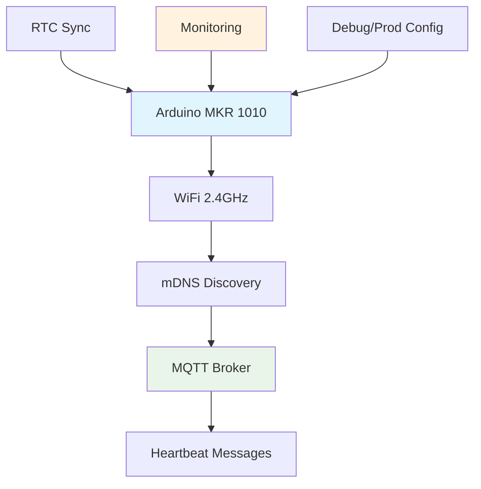

# Arduino MKR 1010 - mDNS MQTT Client

Un client Arduino professionnel qui découvre automatiquement les serveurs MQTT sur le
réseau local via mDNS et publie des messages de heartbeat. Incluant infrastructure
complète de test, monitoring et déploiement production.

## 📋 Table des matières

- [Fonctionnalités](#-fonctionnalités)
- [Installation Rapide](#-installation-rapide)
- [Documentation](#-documentation)
- [Configuration](#️-configuration)
- [Tests et Validation](#-tests-et-validation)
- [Production](#-production)
- [Dépannage](#️-dépannage)
- [Contribution](#-contribution)

## ✨ Fonctionnalités

### 🔧 Core Features

- **Découverte automatique** des serveurs MQTT via mDNS (`_mqtt._tcp.local`)
- **Synchronisation RTC** avec serveurs de temps via WiFi.getTime()
- **Publication périodique** de messages heartbeat configurables
- **Gestion d'erreurs robuste** avec récupération automatique
- **Code optimisé** utilisant `snprintf` pour le formatage sécurisé
- **Fonctionnement non-bloquant** avec machine à états

### 🚀 Professional Features

- **Configuration debug/production** séparée avec optimisations
- **Suite de tests hardware** complète et automatisée
- **Monitoring temps réel** avec dashboard web
- **Documentation API** exhaustive
- **Procédures de déploiement** sécurisées
- **Outils de diagnostic** intégrés

## 🚀 Installation Rapide

### Prérequis

- Arduino MKR WiFi 1010
- Connexion WiFi 2.4GHz
- Serveur MQTT sur le réseau local (Mosquitto, Home Assistant, etc.)

### Installation

1. **Cloner le repository**

   ```bash
   git clone https://github.com/dessyd/Arduino-mDNS-UDP.git
   cd Arduino-mDNS-UDP
   ```

2. **Configuration WiFi**

   ```bash
   cp arduino_secrets.h.example arduino_secrets.h
   # Éditer avec vos paramètres WiFi
   ```

3. **Choisir la configuration**

   **Mode Debug (développement):**

   ```bash
   # Utiliser config.h par défaut (DEBUG=true)
   ```

   **Mode Production:**

   ```bash
   cp config-production.h config.h
   ```

4. **Upload vers Arduino**

   ```bash
   # Via Arduino IDE ou CLI
   arduino-cli compile --fqbn arduino:samd:mkrwifi1010 Arduino-mDNS-UDP.ino
   arduino-cli upload -p /dev/ttyACM0 --fqbn arduino:samd:mkrwifi1010 Arduino-mDNS-UDP.ino
   ```

## 📚 Documentation

| Document | Description | Usage |
|----------|-------------|-------|
| **[API.md](API.md)** | Documentation API complète | Développement, référence |
| **[HARDWARE_TESTS.md](HARDWARE_TESTS.md)** | Procédures de test hardware | Validation, QA |
| **[TROUBLESHOOTING.md](TROUBLESHOOTING.md)** | Guide de dépannage | Support, debug |
| **[CONTRIBUTING.md](CONTRIBUTING.md)** | Guide de contribution | Développement collaboratif |

### Architecture Système



## ⚙️ Configuration

### Fichiers de Configuration

#### `arduino_secrets.h`

```cpp
#define SECRET_SSID "VotreWiFi"
#define SECRET_PASS "VotreMotDePasse"
```

#### `config.h` (Debug)

```cpp
#define DEBUG true                 // Messages série activés
#define SEARCH_INTERVAL 30000      // Recherche mDNS toutes les 30s
#define PUBLISH_INTERVAL 60000     // Publication toutes les 1min
#define MDNS_SERVICE_TYPE "mosquitto" // Service spécifique
```

#### `config-production.h` (Production)

```cpp
#define DEBUG false                // Pas de debug
#define SEARCH_INTERVAL 60000      // Recherche moins fréquente
#define PUBLISH_INTERVAL 300000    // Publication toutes les 5min
#define MDNS_SERVICE_TYPE "mqtt"   // Service générique
```

### Personnalisation Avancée

```cpp
// Topic MQTT personnalisé
#define MQTT_TOPIC "/maison/salon/arduino"

// Format de message personnalisé
#define HEARTBEAT_MESSAGE_FORMAT "Capteur %s actif - %s"

// Intervalles personnalisés
#define SEARCH_INTERVAL 15000      // 15 secondes
#define PUBLISH_INTERVAL 30000     // 30 secondes
```

## 🧪 Tests et Validation

### Tests Automatisés

```bash
# Suite complète de tests
./master_test.sh all

# Tests spécifiques
./master_test.sh unit          # Tests unitaires
./master_test.sh integration   # Tests d'intégration
./master_test.sh robustness    # Tests de robustesse
./master_test.sh performance   # Tests de performance
```

### Tests Manuels Rapides

```bash
# Test connectivité réseau
python3 test_wifi_connection.py --port /dev/ttyACM0

# Test découverte mDNS
avahi-browse -t _mqtt._tcp

# Test broker MQTT
mosquitto_sub -h localhost -t "/arduino" -v
```

### Monitoring Temps Réel

```bash
# Démarrer monitoring
python3 mqtt_monitor.py

# Dashboard web (si configuré)
open http://localhost:8080/dashboard
```

## 🏭 Production

### Déploiement Production

```bash
# Script de déploiement automatisé
./deploy_production.sh

# Validation post-déploiement
python3 production_validation.py --port /dev/ttyACM0

# Monitoring continu
python3 production_monitoring.py
```

### Métriques de Production

✅ **Critères de Validation:**

- Uptime > 95%
- Latence publication < 5s
- Consommation < 50mA moyenne
- Taux d'erreur < 5%
- Test longue durée 72h

📊 **Monitoring:**

- Messages MQTT en temps réel
- Métriques de performance
- Alertes automatiques
- Reporting journalier

## 🛠️ Dépannage

### Problèmes Courants

| Symptôme | Cause Probable | Solution Rapide |
|----------|----------------|----------------|
| WiFi ne connecte pas | SSID/Password incorrect | Vérifier `arduino_secrets.h` |
| Serveur MQTT non trouvé | mDNS non configuré | `avahi-browse -t _mqtt._tcp` |
| Messages non reçus | Topic incorrect | Vérifier topic exact |
| Consommation élevée | Mode debug actif | Utiliser `config-production.h` |
| RTC non sync | Pas d'Internet | Vérifier connectivité NTP |

### Outils de Diagnostic

```bash
# Diagnostic complet automatique
python3 comprehensive_diagnostics.py

# Test réseau spécifique
python3 wifi_diagnostics.py

# Test mDNS spécifique
python3 mdns_diagnostics.py
```

## 📈 Performance

### Optimisations Production

**Mémoire:**

- Utilisation `snprintf` au lieu de String
- Buffers statiques pré-alloués
- Macros debug conditionnelles

**Réseau:**

- Intervals adaptatifs selon signal
- Timeout dynamiques
- Reconnexion intelligente

**Énergie:**

- Mode basse consommation WiFi
- Publications moins fréquentes
- Optimisation puissance TX

### Métriques Typiques

```text
📊 Performance en Production:
   WiFi Connect: < 30s
   mDNS Discovery: < 60s  
   MQTT Connect: < 10s
   Publish Latency: < 5s
   Power Consumption: 35-45mA
   Uptime: > 95%
```

## 🤝 Contribution

Les contributions sont les bienvenues ! Voir [CONTRIBUTING.md](CONTRIBUTING.md) pour:

- 🐛 Signalement de bugs
- ✨ Nouvelles fonctionnalités
- 📖 Améliorations documentation
- 🧪 Nouveaux tests

### Développement

```bash
# Setup environnement dev
git clone https://github.com/dessyd/Arduino-mDNS-UDP.git
cd Arduino-mDNS-UDP

# Installer dépendances Python (pour tests)
pip3 install paho-mqtt pyserial

# Lancer tests avant commit
./master_test.sh unit
```

## 📄 Licence

Ce projet est sous licence MIT. Voir le fichier [LICENSE](LICENSE) pour plus de détails.

---

## 🎆 Créé avec ❤️ pour les projets IoT Arduino
