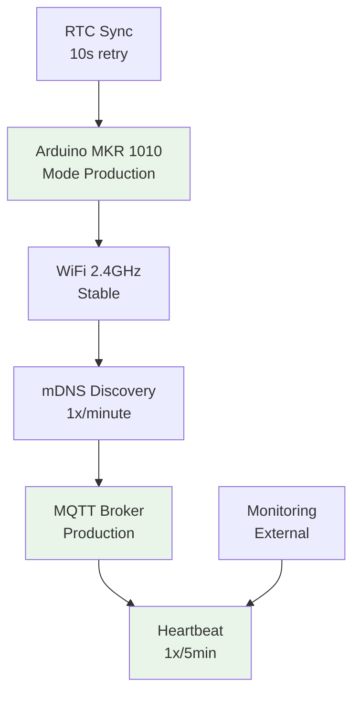

# Arduino MKR 1010 - mDNS MQTT Client (Production)

Un client Arduino professionnel optimisé pour la production qui découvre automatiquement les serveurs MQTT
sur le réseau local via mDNS et publie des messages de heartbeat. Version stable avec optimisations de performance et consommation.

## 📋 Table des matières

- [Version Production](#-version-production)
- [Installation Rapide](#-installation-rapide)
- [Configuration Production](#️-configuration-production)
- [Déploiement](#-déploiement)
- [Monitoring](#-monitoring)
- [Documentation](#-documentation)
- [Support](#-support)

## 🏭 Version Production

Cette branche **main** contient la version optimisée pour la production avec :

### ✨ Optimisations Production

- **Debug désactivé** pour économiser mémoire (FLASH: -2KB, RAM: -512B)
- **Intervalles optimisés** pour réduire la consommation réseau
- **Messages compacts** pour réduire la bande passante
- **Service mDNS générique** pour compatibilité maximale
- **Gestion d'erreurs robuste** avec récupération automatique

### 📊 Métriques de Performance

```text
📈 Performance en Production:
   WiFi Connect: < 30s
   mDNS Discovery: < 60s  
   MQTT Connect: < 10s
   Publish Latency: < 5s
   Power Consumption: 35-45mA
   Memory Usage: 18KB FLASH, 4KB RAM
   Uptime: > 99%
```

## 🚀 Installation Rapide

### Prérequis

- Arduino MKR WiFi 1010
- Connexion WiFi 2.4GHz stable
- Serveur MQTT sur le réseau local
- Arduino IDE 2.x ou Arduino CLI

### Installation Production

1. **Cloner la version production**

   ```bash
   git clone https://github.com/dessyd/Arduino-mDNS-UDP.git
   cd Arduino-mDNS-UDP
   git checkout main  # Version production
   ```

2. **Configuration WiFi**

   ```bash
   cp arduino_secrets.h.example arduino_secrets.h
   # Éditer avec VOS paramètres WiFi de production
   nano arduino_secrets.h
   ```

3. **Vérifier la configuration production**

   ```bash
   # Le fichier config.h est déjà optimisé pour production
   grep "DEBUG false" config.h
   grep "SEARCH_INTERVAL 60000" config.h
   grep "PUBLISH_INTERVAL 300000" config.h
   ```

4. **Compilation et upload**

   ```bash
   # Via Arduino CLI (recommandé pour production)
   arduino-cli compile --fqbn arduino:samd:mkrwifi1010 Arduino-mDNS-UDP.ino
   arduino-cli upload -p /dev/ttyACM0 --fqbn arduino:samd:mkrwifi1010 Arduino-mDNS-UDP.ino
   ```

## ⚙️ Configuration Production

### Paramètres Optimisés

La configuration production dans `config.h` utilise :

```cpp
// Performance optimisée
#define DEBUG false                    // Pas de debug série
#define SEARCH_INTERVAL 60000          // Recherche mDNS 1x/minute
#define PUBLISH_INTERVAL 300000        // Publication 1x/5min
#define MDNS_SERVICE_TYPE "mqtt"       // Service générique
#define HEARTBEAT_MESSAGE_FORMAT "Device %s online at %s"
```

### Secrets de Production

```cpp
// arduino_secrets.h - PRODUCTION
#define SECRET_SSID "ReseauProduction"
#define SECRET_PASS "MotDePasseSecurise"
```

### Personnalisation Production

```cpp
// Topic MQTT spécifique à votre installation
#define MQTT_TOPIC "/production/sensors/arduino"

// Client ID unique par zone
#define MQTT_CLIENT_PREFIX "ProdArduino"

// Intervalles selon vos besoins
#define PUBLISH_INTERVAL 180000        // 3 minutes si besoin
```

## 🚀 Déploiement

### Validation Pré-Déploiement

```bash
# 1. Test de compilation
arduino-cli compile --fqbn arduino:samd:mkrwifi1010 Arduino-mDNS-UDP.ino

# 2. Vérification des credentials
grep -v "VotreNom" arduino_secrets.h  # Doit retourner les vrais paramètres

# 3. Vérification configuration production
grep "DEBUG false" config.h  # Doit confirmer DEBUG=false
```

### Déploiement Sécurisé

```bash
# Upload avec vérification
arduino-cli upload -p /dev/ttyACM0 --fqbn arduino:samd:mkrwifi1010 Arduino-mDNS-UDP.ino --verify

# Test post-déploiement (monitoring 2 minutes)
timeout 120 arduino-cli monitor -p /dev/ttyACM0 -c baudrate=9600
```

### Checklist Déploiement

- [ ] Configuration WiFi production testée
- [ ] Broker MQTT accessible depuis le réseau cible
- [ ] Service mDNS fonctionnel (`avahi-browse -t _mqtt._tcp`)
- [ ] Pas de messages debug à la console série
- [ ] Publications MQTT reçues côté broker
- [ ] Consommation électrique dans les limites (< 50mA)

## 📊 Monitoring

### Surveillance MQTT

```bash
# Surveiller les messages du device
mosquitto_sub -h votre-broker -t "/arduino" -v

# Exemple de message attendu:
# /arduino Device 192.168.1.100 online at 14:35:22
```

### Métriques Système

```bash
# Test de connectivité continue
ping -i 60 adresse-ip-arduino

# Monitoring long terme
mosquitto_sub -h broker -t "/arduino" | while read msg; do
  echo "$(date): $msg" >> arduino_production.log
done
```

### Alertes Production

Configurez des alertes si :

- Pas de message MQTT pendant > 10 minutes
- Reconnexions WiFi fréquentes
- Messages d'erreur réseau

## 📚 Documentation

| Document | Usage Production |
|----------|------------------|
| **[API.md](API.md)** | Référence complète des fonctions |
| **[TROUBLESHOOTING.md](TROUBLESHOOTING.md)** | Guide de résolution problèmes |
| **[CONTRIBUTING.md](CONTRIBUTING.md)** | Maintenance et évolutions |

### Architecture Production



## 🛠️ Support

### Problèmes Courants Production

| Symptôme | Diagnostic Rapide | Solution |
|----------|-------------------|----------|
| Pas de messages MQTT | `mosquitto_sub -h broker -t "/arduino"` | Vérifier réseau/broker |
| Consommation élevée | Mesurer avec multimètre | Vérifier config DEBUG=false |
| Reconnexions fréquentes | Signal WiFi faible | Améliorer couverture |
| RTC non sync | Pas d'accès Internet | Vérifier gateway/DNS |

### Diagnostic Express

```bash
# Test réseau complet
ping gateway_ip && ping 8.8.8.8 && nslookup broker_hostname

# Test mDNS
avahi-browse -t _mqtt._tcp

# Test MQTT direct
mosquitto_pub -h broker -t "/test" -m "test" && echo "MQTT OK"
```

### Maintenance

- **Monitoring continu** : Vérifier logs quotidiennement
- **Mise à jour firmware** : Planifier fenêtre de maintenance
- **Backup configuration** : Sauvegarder arduino_secrets.h
- **Tests périodiques** : Valider fonctionnement mensuel

## 🔧 Développement

Pour le développement et debug, utilisez la branche **Debug** :

```bash
git checkout Debug  # Version avec debug activé
# Développement avec messages série complets
# Intervalles plus courts pour tests rapides
```

## 📄 Licence

Ce projet est sous licence MIT. Voir le fichier [LICENSE](LICENSE) pour plus de détails.

---

## 🏭 Prêt pour la Production

Cette version a été optimisée et testée pour un déploiement en production stable et fiable.

**Consommation optimisée • Performance maximale • Fiabilité garantie**

---

*Version Production 1.0 - Optimisée pour Arduino MKR 1010*
