# Arduino MKR 1010 - mDNS MQTT Client

Un client Arduino qui découvre automatiquement les serveurs MQTT sur le
réseau local via mDNS et publie des messages de heartbeat toutes les minutes.

## 📋 Table des matières

- [Fonctionnalités](#-fonctionnalités)
- [Matériel requis](#-matériel-requis)
- [Librairies nécessaires](#-librairies-nécessaires)
- [Configuration](#️-configuration)
- [Installation](#-installation)
- [Fonctionnement](#-fonctionnement)
- [Organigramme](#-organigramme)
- [Messages série](#-messages-série)
- [Format des messages MQTT](#-format-des-messages-mqtt)
- [Dépannage](#️-dépannage)
- [Licence](#-licence)

## ✨ Fonctionnalités

- **Découverte automatique** des serveurs MQTT via mDNS (`_mqtt._tcp.local`)
- **Synchronisation RTC** avec serveurs de temps via WiFi.getTime()
- **Publication périodique** de messages heartbeat (toutes les minutes)
- **Gestion d'erreurs robuste** avec récupération automatique
- **Code optimisé** utilisant `snprintf` pour le formatage
- **Fonctionnement non-bloquant** avec gestion d'états

## 🔧 Matériel requis

- Arduino MKR WiFi 1010
- Connexion WiFi 2.4GHz
- Serveur MQTT sur le réseau local
  (ex: Mosquitto, Home Assistant, etc.)

## 📚 Librairies nécessaires

Les librairies suivantes doivent être installées via le gestionnaire de librairies Arduino :

- `WiFiNINA` (incluse avec MKR 1010)
- `RTCZero` (incluse avec MKR 1010)
- `PubSubClient` par Nick O'Leary

## ⚙️ Configuration

### 1. Fichier arduino_secrets.h

Créez un fichier `arduino_secrets.h` dans le même dossier que le sketch :

```cpp
#define SECRET_SSID "VotreNomWiFi"
#define SECRET_PASS "VotreMotDePasseWiFi"
```

### 2. Configuration réseau

Le code utilise les paramètres par défaut suivants :

- **Port MQTT** : 1883 (standard)
- **Topic de publication** : `/arduino`
- **Port UDP local** : 5354
- **Adresse multicast mDNS** : 224.0.0.251:5353

## 🚀 Installation

1. **Clonez** le repository

   ```bash
   git clone https://github.com/[username]/Arduino-mDNS-UDP.git
   cd Arduino-mDNS-UDP
   ```

2. **Créez** le fichier de configuration

   ```bash
   cp arduino_secrets.h.example arduino_secrets.h
   ```

3. **Éditez** `arduino_secrets.h` avec vos paramètres WiFi

   ```cpp
   #define SECRET_SSID "VotreNomWiFi"
   #define SECRET_PASS "VotreMotDePasseWiFi"
   ```

4. **Ouvrez** `Arduino-mDNS-UDP.ino` dans l'IDE Arduino

5. **Installez** les librairies nécessaires via le gestionnaire de librairies

6. **Sélectionnez** la carte "Arduino MKR WiFi 1010"

7. **Téléversez** le code

## 🔄 Fonctionnement

### Phase 1 : Initialisation

1. **Connexion WiFi** - Établissement de la connexion réseau
2. **Initialisation RTC** - Démarrage du module d'horloge temps réel
3. **Synchronisation RTC** - Récupération de l'heure via WiFi.getTime()
4. **Démarrage UDP** - Initialisation du client mDNS

### Phase 2 : Découverte MQTT

1. **Requête mDNS** - Envoi de `_mqtt._tcp.local` toutes les 30 secondes
2. **Écoute des réponses** - Analyse des paquets UDP entrants
3. **Détection MQTT** - Identification des serveurs MQTT disponibles
4. **Sauvegarde IP** - Mémorisation de l'adresse du serveur trouvé

### Phase 3 : Publication MQTT

1. **Connexion MQTT** - Établissement de la connexion au serveur
2. **Publication périodique** - Envoi de messages toutes les minutes
3. **Maintenance** - Surveillance de la connexion MQTT

## 📊 Organigramme

```mermaid
flowchart TD
    A["DÉBUT - setup()"] --> B["Initialisation Serial"]
    B --> C["Connexion WiFi<br/>connectToWiFi()"]
    C --> D{"WiFi<br/>connecté?"}
    D -->|Non| C
    D -->|Oui| E["Initialisation RTC<br/>initializeRTC()"]
    E --> F["Démarrage UDP<br/>port 5354"]
    F --> G["Afficher 'Système initialisé'"]
    G --> H["BOUCLE PRINCIPALE - loop()"]
    
    H --> I{"RTC<br/>synchronisé?"}
    I -->|Non| J["Tentative sync RTC<br/>tryToSyncRTC()"]
    J --> K{"WiFi.getTime()<br/>!= 0?"}
    K -->|Oui| L["rtc.setEpoch(epochTime)"]
    L --> M["rtcInitialized = true"]
    M --> N{"Serveur MQTT<br/>trouvé?"}
    K -->|Non| O["Attendre 5 sec"]
    O --> N
    I -->|Oui| N
    
    N -->|Non| P{"Temps pour<br/>recherche?"}
    P -->|Oui| Q["Recherche MQTT<br/>searchForMQTTServer()"]
    Q --> R["Construire paquet mDNS<br/>_mqtt._tcp.local"]
    R --> S["Envoyer requête UDP<br/>vers 224.0.0.251:5353"]
    S --> T["Écouter réponses<br/>listenForMDNSResponses()"]
    T --> U{"Paquet reçu?"}
    U -->|Non| H
    U -->|Oui| V{"Contient<br/>'mqtt'?"}
    V -->|Non| H
    V -->|Oui| W["Sauver IP serveur<br/>mqttServerFound = true"]
    W --> X["CONNEXION MQTT<br/>connectToMQTT()"]
    P -->|Non| T
    
    N -->|Oui| Y{"MQTT<br/>connecté?"}
    Y -->|Non| X
    X --> Z{"Connexion<br/>réussie?"}
    Z -->|Non| AA["mqttServerFound = false"]
    AA --> H
    Z -->|Oui| BB["mqttConnected = true"]
    BB --> CC{"Temps pour<br/>publication?"}
    
    Y -->|Oui| CC
    CC -->|Non| DD["Maintenir connexion<br/>mqttClient.loop()"]
    DD --> H
    CC -->|Oui| EE["PUBLICATION<br/>publishHeartbeat()"]
    
    EE --> FF["Formater timestamp<br/>snprintf '%02d:%02d:%02d'"]
    FF --> GG["Formater IP<br/>snprintf '%d.%d.%d.%d'"]
    GG --> HH["Créer message<br/>'IP vous dit bonjour. Il est HH:MM:SS'"]
    HH --> II["Publier sur topic /arduino"]
    II --> JJ{"Publication<br/>réussie?"}
    JJ -->|Oui| KK["Afficher succès"]
    JJ -->|Non| LL["Afficher erreur"]
    KK --> DD
    LL --> DD
    
    style A fill:#e1f5fe
    style H fill:#fff3e0
    style EE fill:#e8f5e8
    style X fill:#fce4ec
    style Q fill:#f3e5f5
    style J fill:#fff8e1
```



## 📟 Messages série

### Démarrage typique

```text
Démarrage du client mDNS/MQTT
Connexion au réseau WiFi: MonWiFi
....
WiFi connecté!
Adresse IP: 192.168.1.100

Initialisation du module RTC...
RTC démarré, synchronisation en cours...

Système initialisé
Recherche d'un serveur MQTT...

Tentative de synchronisation RTC avec WiFi.getTime()...
RTC synchronisé avec WiFi.getTime()!
Heure actuelle: 23/06/2025 14:35:22

--- Recherche serveur MQTT ---
Requête mDNS envoyée

*** SERVEUR MQTT TROUVÉ! ***
IP du serveur: 192.168.1.50
Arrêt de la recherche mDNS
Connexion au serveur MQTT...

Connexion MQTT à 192.168.1.50:1883
Connexion MQTT réussie!
Publication de messages toutes les minutes...
```

### Publication de messages

```text
--- Publication MQTT ---
Sujet: /arduino
Message: 192.168.1.100 vous dit bonjour. Il est 14:35:22
Message publié avec succès!
```

## 📨 Format des messages MQTT

### Topic

```text
/arduino
```

### Payload

```text
<IP_Arduino> vous dit bonjour. Il est <HH:MM:SS>
```

### Exemple

```text
192.168.1.100 vous dit bonjour. Il est 14:35:22
```

## 🛠️ Dépannage

### Problèmes courants

#### WiFi ne se connecte pas

- Vérifiez les identifiants dans `arduino_secrets.h`
- Assurez-vous que le réseau est en 2.4GHz
- Vérifiez la portée du signal WiFi

#### Serveur MQTT non trouvé

- Vérifiez que le serveur MQTT est démarré
- Testez la connectivité réseau avec `ping`
- Vérifiez que le serveur annonce le service mDNS

#### RTC non synchronisé

- Vérifiez la connexion Internet
- Le système continue de fonctionner avec `--:--:--`
- La synchronisation sera retentée automatiquement

#### Messages MQTT non reçus

- Vérifiez la connexion au broker MQTT
- Testez avec un client MQTT (ex: MQTT Explorer)
- Vérifiez les logs du serveur MQTT

### Messages de debug

Le code affiche des messages détaillés pour faciliter le debug :

- État des connexions WiFi et MQTT
- Tentatives de synchronisation RTC
- Détection des serveurs MQTT
- Succès/échecs des publications

## 🔧 Personnalisation

### Modifier l'intervalle de publication

```cpp
const unsigned long PUBLISH_INTERVAL = 30000; // 30 secondes
```

### Changer le topic MQTT

```cpp
if (mqttClient.publish("/mon-arduino", message)) {
```

### Modifier le message

```cpp
snprintf(message, sizeof(message), "%s dit: Système OK à %s", ipStr, timeStr);
```

## 📁 Structure du projet

```text
Arduino-mDNS-UDP/
├── .github/
│   ├── ISSUE_TEMPLATE/
│   │   ├── bug_report.md
│   │   └── feature_request.md
│   ├── workflows/
│   │   └── ci.yml
│   └── pull_request_template.md
├── Arduino-mDNS-UDP.ino        # Code principal
├── arduino_secrets.h.example   # Template de configuration
├── .gitignore                  # Fichiers à ignorer par Git
├── CONTRIBUTING.md             # Guide de contribution
├── LICENSE                     # Licence MIT
└── README.md                   # Cette documentation

# Fichier à créer localement :
arduino_secrets.h               # Configuration WiFi (ne pas committer!)
```

## 🚀 Fonctionnalités avancées

### Optimisations du code

- **Utilisation de `snprintf`** pour un formatage sûr et efficace
- **`rtc.setEpoch()`** pour simplifier la synchronisation temporelle
- **Gestion d'états non-bloquante** pour un fonctionnement fluide
- **Récupération automatique** en cas d'erreurs réseau

### Robustesse

- **Tentatives répétées** pour la synchronisation RTC
- **Reconnexion automatique** WiFi et MQTT
- **Fallback gracieux** en cas d'échec des services
- **Messages de diagnostic** détaillés

## 🤝 Contribution

Les contributions sont les bienvenues ! N'hésitez pas à :

- Signaler des bugs
- Proposer des améliorations
- Soumettre des pull requests
- Améliorer la documentation

## 📄 Licence

Ce projet est sous licence MIT. Voir le fichier LICENSE pour plus de détails.

---

## 🎆 Créé avec ❤️ pour les projets IoT Arduino
